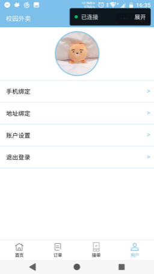

## 微信小程序校园外卖系统－数据库课程设计

### 基本功能😄

学生客户可以在查看在售商品的各种信息，选择商品后下单，在系统内查看订单状态（制作中，派单中，接单中等），在订单完成后可以对购买商品进行评分评价，在用户界面完善自身地址，头像，电话等相关信息。

商家可以增加，删除，修改出售的商品，接单，制作完成后派单给想要进行兼职工作的系统用户，查看商家的各种统计信息。

学生配送员可以在系统中查看商家在发布的各种派单信息，接单后将外卖送至客户手中。

### 小程序界面预览👀

#### 买家页面

#### 卖家页面

### 实现方式👨🏼‍💻

本项目采用前后端分离的方式开发。由于Flask框架具有轻巧，简洁等明显优势，我们采用其作为后端框架。微信小程序利用POST方式传递参数到服务器后端，后端接受小程序的表单信息，在数据库进行相应的增加，删除，查询，修改操作，并将结果通过JSON数据返回至微信小程序前端。

数据库采用MySQL，首先通过Navicat软件进行基本的创建表，创建视图，创建触发器，设置完整性约束。服务器后端通过pymysql进行对数据库的操作，统计分析页面使用Echarts实现。

### 如何配置🔧

- 用户需要在服务器上安装mysql，使用Navicat等工具创建一个新的数据库meituan。然后导入我们提供的数据库初始化脚本`/server/Database/setup.sql`等待脚本运行成功。到这里为止数据库初始化成功。
- 